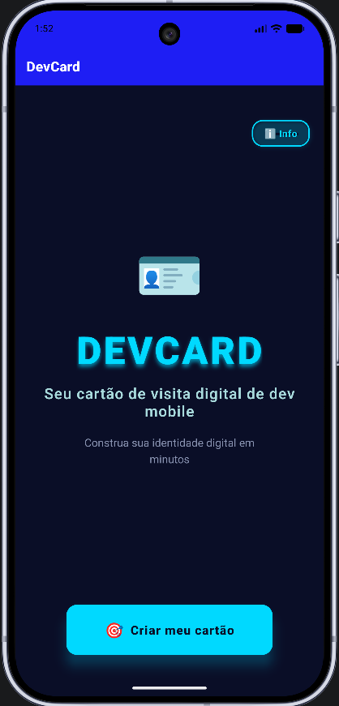
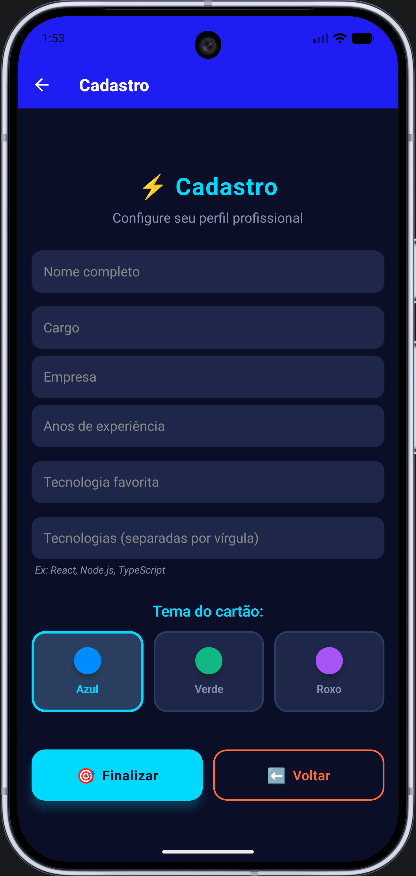
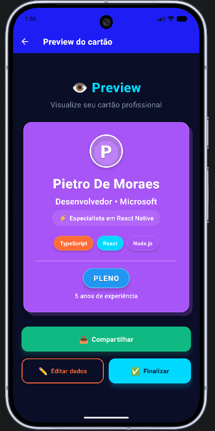
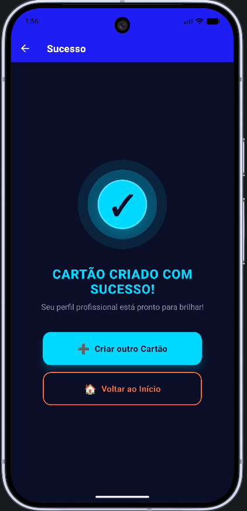
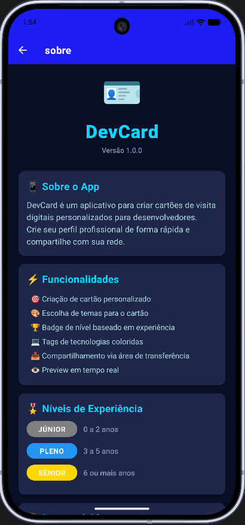

# DevCard - Cartão de Visita Digital

**Versão:** 1.0.0

Aplicativo mobile desenvolvido em React Native para criação de cartões de visita digitais personalizados. Permite que desenvolvedores construam seu perfil profissional de forma rápida, com preview em tempo real e funcionalidade de compartilhamento.

---

## Índice

- [Visão Geral](#visão-geral)
- [Características Principais](#características-principais)
- [Telas do Aplicativo](#telas-do-aplicativo)
- [Tecnologias](#tecnologias)
- [Instalação e Configuração](#instalação-e-configuração)
- [Guia de Uso](#guia-de-uso)
- [Arquitetura do Aplicativo](#arquitetura-do-aplicativo)
- [Design e Interface](#design-e-interface)
- [Autor](#autor)

---

## Visão Geral

DevCard é uma solução mobile que permite a criação de cartões de visita digitais profissionais. O aplicativo oferece uma interface moderna com tema escuro, sistema de badges baseado em experiência, e suporte para múltiplas tecnologias com visualização em chips coloridos.

### Principais Recursos

O aplicativo permite personalização completa do perfil profissional, incluindo informações como nome, cargo, empresa, anos de experiência e stack tecnológico. Todos os dados podem ser visualizados em tempo real antes da confirmação final.

---

## Características Principais

### Funcionalidades Core

- **Criação de Perfil Personalizado**: Formulário completo para inserção de dados profissionais
- **Sistema de Temas**: Três opções de cores (Oceano, Fogo, Neon) para personalização do cartão
- **Classificação Automática**: Badge de nível baseado em anos de experiência (Júnior, Pleno, Sênior)
- **Visualização de Tecnologias**: Tags coloridas para representar stack tecnológico
- **Preview em Tempo Real**: Visualização do cartão antes da confirmação
- **Compartilhamento**: Exportação dos dados formatados para área de transferência
- **Interface Dark Theme**: Design moderno com tema escuro e efeitos neon

### Sistema de Níveis

O aplicativo classifica automaticamente o profissional em três categorias:

| Nível | Experiência | Cor da Badge |
|-------|-------------|--------------|
| Júnior | 0 a 2 anos | Cinza (#808080) |
| Pleno | 3 a 5 anos | Azul (#2196F3) |
| Sênior | 6+ anos | Dourado (#FFD700) |

---

## Telas do Aplicativo

### 1. Tela Inicial (index.tsx)



**Descrição:** Tela de boas-vindas do aplicativo com design dark theme.

**Elementos Principais:**
- Ícone de foguete em destaque
- Título "DevCard" com efeito neon azul (#00d9ff)
- Subtítulo "Cartão Digital Profissional"
- Descrição "Construa sua identidade digital em minutos"
- Botão principal "Começar Agora" em laranja (#ff6b35)
- Botão "Info" no canto superior direito

**Funcionalidades:**
- Navegação para tela de cadastro
- Acesso às informações do aplicativo
- Background dark theme (#0a0e27)

---

### 2. Tela de Cadastro (cadastro.tsx)



**Descrição:** Formulário completo para criação do cartão de visita com validação em tempo real.

**Campos de Entrada:**
- Nome completo (obrigatório, mínimo 3 caracteres)
- Cargo (obrigatório)
- Empresa (opcional)
- Anos de experiência (obrigatório, numérico)
- Tecnologia favorita (obrigatória)
- Tecnologias (obrigatório, separadas por vírgula)

**Seleção de Tema:**
Três opções de temas para o cartão:
- **Azul**: #00d9ff 
- **Verde**: '#10b981' 
- **Roxo**: #a855f7 

**Validações:**
- Validação em tempo real durante digitação
- Mensagens de erro específicas para cada campo
- Destaque visual em campos inválidos (borda vermelha)
- Texto de ajuda para campo de tecnologias

**Botões de Ação:**
- "Finalizar Cadastro" - Valida e avança para preview
- "Voltar" - Retorna à tela inicial

**Design:**
- Inputs com background dark (#1e2749)
- Texto branco para melhor contraste
- Botões de tema com seleção visual (borda branca)

---

### 3. Tela de Preview (preview.tsx)



**Descrição:** Visualização completa do cartão de visita criado com todas as informações formatadas.

**Componentes do Cartão:**
- **Avatar Circular**: Primeira letra do nome em destaque com fundo semi-transparente
- **Nome**: Fonte grande e bold em branco
- **Cargo e Empresa**: Separados por ponto, fonte média
- **Especialização**: "Especialista em [tecnologia favorita]" em itálico
- **Chips de Tecnologias**: Tags coloridas com as tecnologias informadas
- **Divisor Visual**: Linha horizontal separando seções
- **Badge de Nível**: Júnior/Pleno/Sênior com cor específica
- **Anos de Experiência**: Texto descritivo abaixo do badge

**Cores dos Chips de Tecnologia:**
Paleta rotativa de 8 cores:
- #ff6b35, #00d9ff, #a855f7, #10b981
- #f59e0b, #ec4899, #06b6d4, #8b5cf6

**Botões de Ação:**
- **Compartilhar** (verde #10b981): Copia dados formatados para área de transferência
- **Editar Dados** (transparente com borda): Volta para o cadastro
- **Confirmar Cartão** (laranja #ff6b35): Finaliza e vai para tela de sucesso

**Funcionalidade de Compartilhamento:**
- Formata os dados como texto estruturado
- Inclui emojis para melhor visualização
- Copia para clipboard
- Exibe Alert de confirmação

---

### 4. Tela de Sucesso (sucesso.tsx)



**Descrição:** Confirmação visual de que o cartão foi criado com sucesso.

**Elementos Visuais:**
- **Ícone Animado**: Três círculos concêntricos com emoji de festa
  - Círculo externo: Laranja claro (opacidade 0.1)
  - Círculo médio: Laranja médio (opacidade 0.3)
  - Círculo interno: Laranja sólido (#ff6b35) com sombra
  - Emoji central: 🎉

**Mensagens:**
- Título: "Cartão Criado!" em cyan (#00d9ff)
- Subtítulo: "Seu perfil profissional está pronto para brilhar!" em cinza claro

**Botões de Ação:**
- **Criar Novo Cartão** (laranja #ff6b35): Navega para novo cadastro
- **Voltar ao Início** (transparente com borda): Retorna à tela inicial

**Design:**
- Background dark theme (#0a0e27)
- Efeito de profundidade nos círculos
- Contraste claro entre botões primário e secundário

---

### 5. Tela Sobre (sobre.tsx)



**Descrição:** Informações completas sobre o aplicativo, funcionalidades e desenvolvedor.

**Seções Informativas:**

1. **Sobre o App**
   - Descrição do propósito do aplicativo
   - Público-alvo

2. **Funcionalidades**
   - Lista completa de recursos
   - Cada item com emoji descritivo

3. **Níveis de Experiência**
   - Badges visuais com cores
   - Júnior (Cinza): 0 a 2 anos
   - Pleno (Azul): 3 a 5 anos
   - Sênior (Dourado): 6 ou mais anos

4. **Desenvolvido por**
   - Nome do desenvolvedor: Pietro de Moraes Vicinoski Fliegner
   - RA: 8500301822
   - Descrição do projeto

5. **Tecnologias Utilizadas**
   - Stack tecnológico completo
   - Cada tecnologia com emoji

**Design:**
- Cards com background dark (#1e2749)
- Títulos em cyan (#00d9ff)
- Conteúdo scrollável
- Botão "Voltar" em laranja no final

---

## Tecnologias

### Stack Principal

- **React Native**: Framework para desenvolvimento mobile multiplataforma
- **Expo**: Plataforma e conjunto de ferramentas para React Native
- **TypeScript**: Superset JavaScript com tipagem estática
- **Expo Router**: Sistema de navegação baseado em arquivos
- **Expo Clipboard**: API para manipulação da área de transferência

### Requisitos do Sistema

- Node.js versão 14 ou superior
- npm ou yarn
- Expo CLI (recomendado)
- Dispositivo físico ou emulador Android/iOS

---

## Instalação e Configuração

### Passo 1: Clonar o Repositório

```bash
git clone <url-do-repositorio>
cd projeto-devcard
```

### Passo 2: Instalar Dependências

```bash
npx expo install
```

### Passo 3: Iniciar o Servidor de Desenvolvimento

```bash
npx expo start -c
```

### Passo 4: Executar no Dispositivo

Opções disponíveis:
- Escanear QR code com Expo Go (Android/iOS)
- Pressionar `a` para Android emulator
- Pressionar `i` para iOS simulator

---

## Guia de Uso

### Fluxo de Criação do Cartão

1. **Tela Inicial**: Acesse o botão "Começar Agora" para iniciar
2. **Cadastro**: Preencha os campos obrigatórios:
   - Nome completo (mínimo 3 caracteres)
   - Cargo profissional
   - Empresa (opcional)
   - Anos de experiência (numérico)
   - Tecnologia favorita
   - Lista de tecnologias (separadas por vírgula)
3. **Seleção de Tema**: Escolha entre Oceano, Fogo ou Neon
4. **Preview**: Visualize o cartão completo com todas as informações
5. **Ações Disponíveis**:
   - Compartilhar: Copia dados formatados
   - Editar: Retorna ao formulário
   - Confirmar: Finaliza a criação
6. **Confirmação**: Tela de sucesso com opções para criar novo cartão ou voltar ao início

### Validações Implementadas

- Nome: Campo obrigatório com mínimo de 3 caracteres
- Cargo: Campo obrigatório
- Anos de experiência: Deve ser um número válido não negativo
- Tecnologia favorita: Campo obrigatório
- Tecnologias: Pelo menos uma tecnologia deve ser informada

---

## Arquitetura do Aplicativo

### Estrutura de Navegação

```
/                    → Tela inicial (index.tsx)
/cadastro           → Formulário de cadastro (cadastro.tsx)
/preview            → Preview do cartão (preview.tsx)
/sucesso            → Confirmação de sucesso (sucesso.tsx)
/sobre              → Informações do app (sobre.tsx)
```

### Componentes Principais

#### 1. Tela Inicial (index.tsx)
Ponto de entrada do aplicativo com apresentação visual e navegação para cadastro ou informações.

**Elementos:**
- Ícone de foguete em destaque
- Título com efeito neon azul
- Botão de ação principal
- Botão de informações no canto superior

#### 2. Tela de Cadastro (cadastro.tsx)
Formulário completo com validação em tempo real e seleção de tema.

**Campos:**
- Inputs de texto para dados pessoais e profissionais
- Seletor de tema com três opções
- Validação inline com mensagens de erro
- Botões de navegação

#### 3. Tela de Preview (preview.tsx)
Visualização completa do cartão com todas as informações formatadas.

**Componentes:**
- Avatar circular com inicial do nome
- Informações do profissional
- Chips de tecnologias coloridos
- Badge de nível com cor específica
- Botões de ação (compartilhar, editar, confirmar)

#### 4. Tela de Sucesso (sucesso.tsx)
Confirmação visual com animação de círculos concêntricos.

**Elementos:**
- Ícone animado de sucesso
- Mensagens de confirmação
- Opções de navegação

#### 5. Tela Sobre (sobre.tsx)
Informações detalhadas sobre o aplicativo e desenvolvedor.

**Seções:**
- Descrição do app
- Lista de funcionalidades
- Níveis de experiência
- Créditos do desenvolvedor
- Stack tecnológico

---

## Design e Interface

### Paleta de Cores

#### Cores Principais
- **Background Dark**: #0a0e27 - Fundo principal da aplicação
- **Neon Blue**: #00d9ff - Títulos e elementos de destaque
- **Orange Fire**: #ff6b35 - Botões primários e ações principais
- **Purple Neon**: #a855f7 - Tema alternativo
- **Text Secondary**: #8892b0 - Textos secundários
- **Card Background**: #1e2749 - Fundo de cards e inputs

#### Temas de Cartão
- **Oceano**: #00d9ff - Tema cyan/azul
- **Fogo**: #ff6b35 - Tema laranja
- **Neon**: #a855f7 - Tema roxo

#### Cores de Tecnologia (Chips)
Paleta rotativa de 8 cores:
- #ff6b35 (Laranja)
- #00d9ff (Cyan)
- #a855f7 (Roxo)
- #10b981 (Verde)
- #f59e0b (Amarelo)
- #ec4899 (Rosa)
- #06b6d4 (Azul claro)
- #8b5cf6 (Violeta)

### Características de Design

#### Validação de Formulário
- Validação em tempo real durante digitação
- Mensagens de erro específicas e contextuais
- Destaque visual em campos com erro
- Feedback imediato ao usuário

#### Sistema de Badges
- Cálculo automático baseado em anos de experiência
- Cores distintas para cada nível profissional
- Texto em uppercase com espaçamento de letras
- Efeitos de sombra para profundidade visual

#### Chips de Tecnologia
- Parsing automático de string separada por vírgulas
- Atribuição rotativa de cores da paleta
- Design arredondado com sombras sutis
- Layout flexível com quebra de linha automática

#### Funcionalidade de Compartilhamento
- Formatação estruturada de texto
- Inclusão de ícones para melhor visualização
- Cópia automática para área de transferência
- Feedback visual através de Alert nativo

---

## Autor

**Pietro de Moraes Vicinoski Fliegner**  
Matrícula: 8500301822

Projeto desenvolvido como atividade prática de desenvolvimento mobile com React Native e Expo.

---

**DevCard** - Transformando perfis profissionais em cartões digitais modernos.
